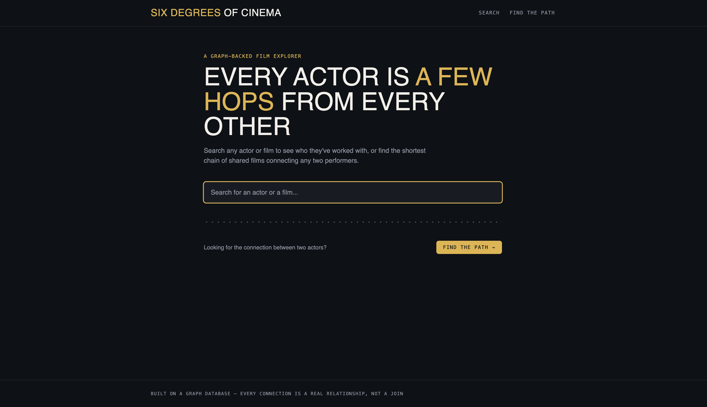
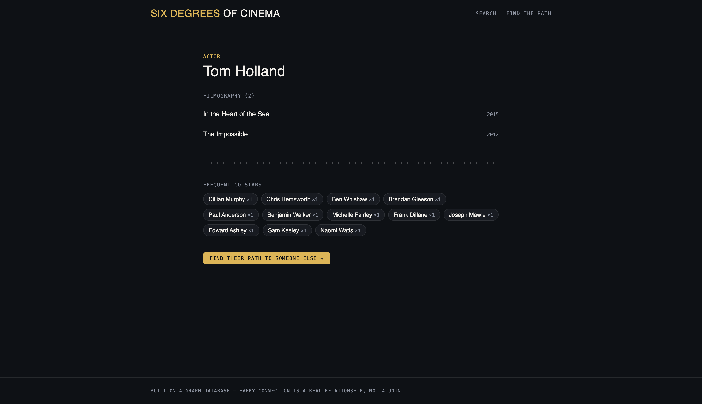
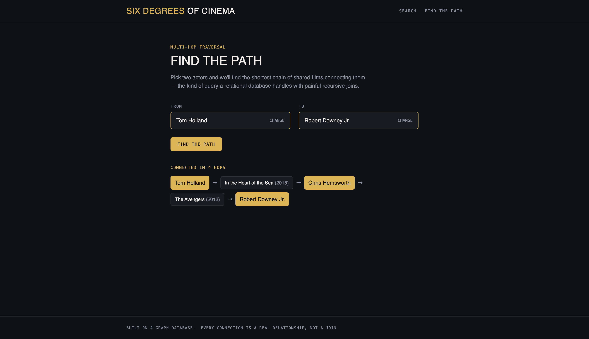

# Six Degrees of Cinema

A film explorer backed by [CognoDB](https://console.cognodb.com), a managed graph database. Search
any actor or film, browse who worked with whom, and find the shortest chain of shared films
connecting any two performers — a real "six degrees of separation" for the movie world.

## Why a graph database?

The interesting questions here are all about *paths*, not *rows*:

- **"How is Actor A connected to Actor B?"** is a variable-length pattern match. In Cypher it's one
  line — `shortestPath((a)-[:ACTED_IN*..6]-(b))`. In SQL, the same question needs a recursive CTE
  that self-joins a cast table an unknown number of times, and gets significantly harder once you
  want the *shortest* path rather than just *a* path.
- **"Recommend films that share cast with this one"** is a 2-hop traversal
  (`Movie → Person → Movie`). In a relational schema this is a self-join through a junction table
  that only gets messier as you add hops — and CognoDB's query planner walks it without materializing
  an intermediate table at all.
- The **co-star graph** itself is the interesting object — not a lookup table, but a network whose
  shape (which actors cluster together, how far apart any two people are) is the actual product
  feature. A graph database stores that network natively; a relational database would spend most of
  its schema simulating one.

None of this data is high-volume or transactional — it's exactly the kind of "the shape of the
connections is the point" problem a graph database earns its place on.

## Data model

```
(:Person {id, name})
(:Movie  {id, title, year, rating, popularity})
(:Genre  {name})

(:Person)-[:ACTED_IN {character}]->(:Movie)
(:Person)-[:DIRECTED]->(:Movie)
(:Movie)-[:IN_GENRE]->(:Genre)
```

```
        ACTED_IN                    IN_GENRE
(Person) ------> (Movie) ---------------------> (Genre)
   ^                |
   |    DIRECTED    |
   +----------------+
```

Co-stars, path-finding, and recommendations are all derived at query time from these three
relationship types — nothing is precomputed or duplicated.

## Setup

### 1. Create a CognoDB Cloud instance

1. Sign up at [console.cognodb.com/signup](https://console.cognodb.com/signup) (free, no card required).
2. Create a free **c0** instance and pick a region — it provisions in under a minute.
3. Copy the connection URI (`bolt+s://<instance-id>.databases.cognodb.com`) and the generated
   password for user `cognodb`. **The password is shown once** — save it now.

### 2. Configure the app

```bash
cp .env.example .env.local
# then fill in COGNODB_URI and COGNODB_PASSWORD
```

### 3. Install dependencies

```bash
npm install
```

### 4. Verify the connection

```bash
npm run test:connection
```

Confirms the driver can reach CognoDB and reports current node/relationship counts.

### 5. Get the seed data

Download `tmdb_5000_movies.csv` and `tmdb_5000_credits.csv` from Kaggle's
["TMDB 5000 Movie Dataset"](https://www.kaggle.com/datasets/tmdb/tmdb-movie-metadata) and place
them in `./data/` (see `data/README.md`).

### 6. Seed the database

```bash
npm run seed
```

This loads the ~800 most popular movies (configurable via `SEED_MOVIE_LIMIT`), their top-billed
cast, directors, and genres — a few thousand nodes and tens of thousands of relationships, sized
to comfortably fit the free tier's 256MB RAM / 1GB disk.

### 7. Run the app

```bash
npm run dev
```

Visit `http://localhost:3000`.

## The main queries

All queries live in `lib/queries.ts` and run through the official `neo4j-driver`, fully
parameterised — no string-concatenated Cypher anywhere in the app.

| Query | What it does | File |
|---|---|---|
| `searchAll` | Substring match on actor/movie names, powers the search box | `lib/queries.ts` |
| `getActor` | Filmography + co-star frequency for one actor | `lib/queries.ts` |
| `getMovie` | Cast, director, genres, plus 2-hop shared-cast recommendations | `lib/queries.ts` |
| `findPath` | **Multi-hop**: shortest path between two actors, capped at 6 hops | `lib/queries.ts` |

The path-finding query is the centerpiece:

```cypher
MATCH path = shortestPath(
  (a:Person {id: $aId})-[:ACTED_IN*..6]-(b:Person {id: $bId})
)
RETURN nodes(path) AS nodes, length(path) AS hops
```

## Project structure

```
app/
  page.tsx              home page + search
  actor/[id]/page.tsx   actor profile (filmography, co-stars)
  movie/[id]/page.tsx   movie detail (cast, recommendations)
  path/page.tsx         path-finder page
  api/search/route.ts   search endpoint
  api/path/route.ts     shortest-path endpoint
components/             UI components (search, path finder, states)
lib/db.ts               CognoDB connection + error wrapping
lib/queries.ts           all Cypher, parameterised
scripts/seed.ts          CSV → graph loader
```

## Error handling
 
Every database call is wrapped in `runQuery` (`lib/db.ts`), which converts driver errors into a
`DatabaseUnavailableError`. Pages and API routes catch this specifically and render a friendly
"database unreachable" state instead of crashing — try it by temporarily blanking
`COGNODB_PASSWORD` in `.env.local`.
 
## Deployment
 
Deployed on [Vercel](https://vercel.com) (free tier). Set `COGNODB_URI` and `COGNODB_PASSWORD` as
environment variables in the Vercel project settings — never commit them.
 
**Live demo:** https://six-degree-cinema.vercel.app/
**Screen recording:** https://drive.google.com/file/d/1GLz1xmXvzjOyuLH2lEKdnTvEEFj8PqCG/view?usp=sharing

## Screenshots

**Home / search**


**Actor profile — filmography and co-stars**


**Find the Path — multi-hop traversal result**
